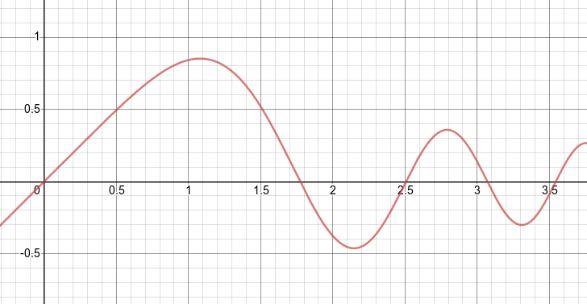

# Hyperopt &nbsp; [](https://travis-ci.org/rayglover-ibm/hyperopt)

_[Global optimization](https://en.wikipedia.org/wiki/Global_optimization) algorithms for node.js_


This node.js package simply wraps the routine `dlib::find_max_global()` from the dlib c++ toolkit. Read more about the algorithms behind this function in [A Global Optimization Algorithm Worth Using](http://blog.dlib.net/2017/12/a-global-optimization-algorithm-worth.html).

## Install

```bash
npm install hyperopt
```

## Example

This simple example shows how to minimize the following function with `findMinGlobal()`:




```js
const hyperopt = require('hyperopt');

// Domain: defines the number of dimensions and their respective
// ranges (minimum, maximum) to evaluate. In this example
// the objective is one dimensional.
const domain = [
    [0, 3.5]
];

// Objective Function: evaluates an input and returns a
// single number i.e. the loss to minimize
const objective = xs => {
    const x = xs[0];
    return (1 / x) * Math.sin(x ** 2);
}

// Iteratively search for the global minimum
const min = hyperopt.findMinGlobal(objective, domain,
    { maxIterations: 10 });

// prints { y: -0.463, x: [ 2.144 ] }
console.info(min);
```

## References

1. _C. Malherbe, N. Vayatis_ – __Global optimization of Lipschitz functions__ – arXiv:1703.02628, Jun 2017.

2. _M.J.D. Powell_ – __The BOBYQA algorithm for bound constrained optimization without derivatives__ – Report DAMTP 2009/NA06, University of Cambridge, Aug 2009.

<br>

---

## License

Copyright 2019 Ray Glover

Licensed under the Apache License, Version 2.0 (the "License");
you may not use this file except in compliance with the License.
You may obtain a copy of the License at

    http://www.apache.org/licenses/LICENSE-2.0

Unless required by applicable law or agreed to in writing, software
distributed under the License is distributed on an "AS IS" BASIS,
WITHOUT WARRANTIES OR CONDITIONS OF ANY KIND, either express or implied.
See the License for the specific language governing permissions and
limitations under the License.
